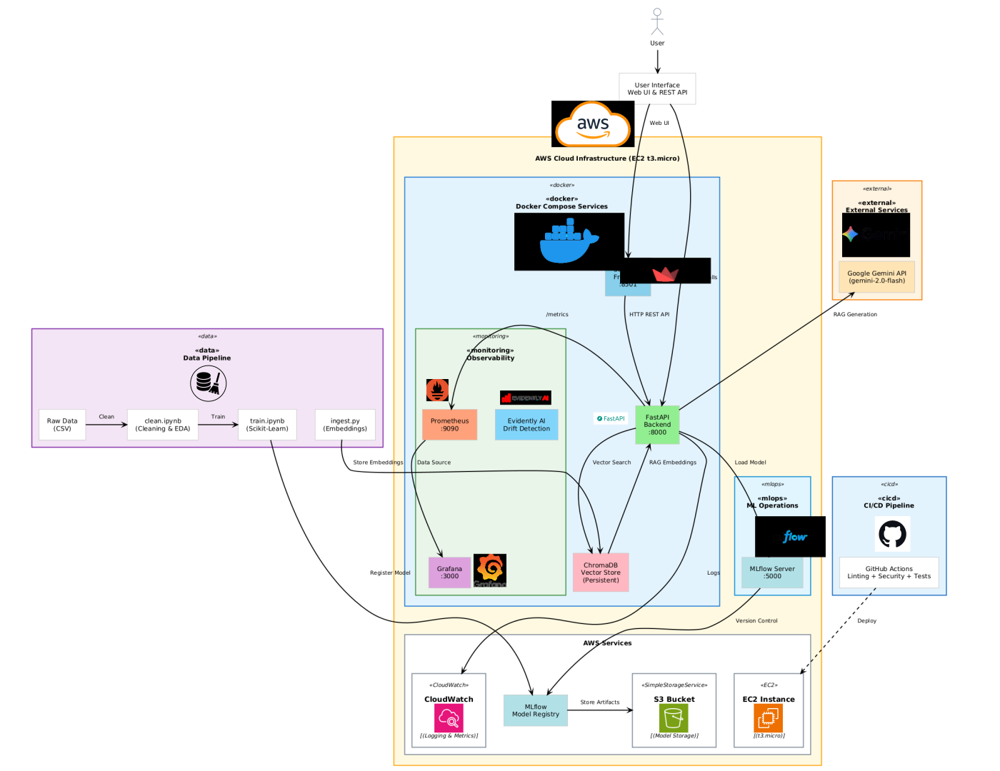

#

# Taste Karachi

MLOps project that predicts restaurant ratings in Karachi (0-5 scale) based on 30+ features including location, amenities, services, and operational characteristics.

## 🌐 Live Demo

Try the application on our public instance:

### Available Services

| Service | URL | Description |
|---------|-----|-------------|
| 🎨 **Streamlit UI** | http://54.196.196.185:8501 | Interactive web interface for predictions |
| 🔌 **FastAPI** | http://54.196.196.185:8000 | REST API backend |
| 📚 **API Docs** | http://54.196.196.185:8000/docs | Interactive API documentation |
| 📊 **Prometheus** | http://54.196.196.185:9090 | Metrics collection |
| 📈 **Grafana** | http://54.196.196.185:3000 | Monitoring dashboards (admin/admin) |
| 📉 **Metrics** | http://54.196.196.185:8000/metrics | Prometheus metrics endpoint |
| 👩‍💻 **MLFlow Server** | http://54.196.196.185:5000/ | Model experiments | 


## ☁️ Cloud Services Used

This project leverages several AWS cloud services for deployment, storage, and monitoring:

- **AWS EC2 (t3.micro)**: Hosts the application services including FastAPI, Streamlit, Prometheus, and Grafana. 
- **AWS S3**: Used for storing trained machine learning models, enabling easy access and versioning for model artifacts.
- **AWS CloudWatch**: Provides monitoring and logging for the deployed services, including resource usage and application logs.


### Quick API Test

**Health Check:**

```bash
curl http://54.196.196.185:8000/health
```

**Make a Prediction:**

```bash
curl -X POST "http://54.196.196.185:8000/predict" \
  -H "Content-Type: application/json" \
  -d '{
    "area": "Clifton",
    "price_level": "PRICE_LEVEL_MODERATE",
    "category": "Restaurant",
    "latitude": 24.8138,
    "longitude": 67.0011,
    "dine_in": true,
    "takeout": true,
    "delivery": false,
    "reservable": true,
    "serves_breakfast": false,
    "serves_lunch": true,
    "serves_dinner": true,
    "serves_coffee": false,
    "serves_dessert": true,
    "outdoor_seating": false,
    "live_music": false,
    "good_for_children": true,
    "good_for_groups": true,
    "good_for_watching_sports": false,
    "restroom": true,
    "parking_free_lot": false,
    "parking_free_street": true,
    "accepts_debit_cards": true,
    "accepts_cash_only": false,
    "wheelchair_accessible": true,
    "is_open_24_7": false,
    "open_after_midnight": false,
    "is_closed_any_day": false
  }'
```

**Response:**

```json
{
  "predicted_rating": 4.25,
  "rating_scale": "0-5",
  "model_version": "v1",
  "model_name": "Restaurant_rating_prediction_regression",
  "input_features": {
    "area": "Clifton",
    "price_level": "PRICE_LEVEL_MODERATE",
    "category": "Restaurant"
  }
}
```

### Using the Streamlit Interface

For a user-friendly experience, visit the **Streamlit UI** at http://54.196.196.185:8501:

1. Fill in restaurant details (location, amenities, services)
2. Click **"Predict Rating"**
3. View the predicted rating and detailed metrics

## 🚀 Local Development

Run the complete stack locally:

```bash
docker-compose -f docker-compose.dev.yml up -d --build
```

**Local Services:**

- **Streamlit UI**: http://localhost:8501
- **FastAPI API**: http://localhost:8000
- **API Docs**: http://localhost:8000/docs
- **Prometheus**: http://localhost:9090
- **Grafana**: http://localhost:3000 (admin/admin)

## 📊 Features

- **ML Model**: Rating prediction with MLflow integration
- **FastAPI Backend**: REST API with automatic documentation
- **Streamlit Frontend**: Interactive web interface
- **Monitoring**: Prometheus metrics + Grafana dashboards
- **CI/CD**: Automated testing, linting, and security scans
- **Production-Ready**: Separate dev/prod configurations

## 💻 Local Development (Without Docker)

```bash
# Install dependencies
pip install -r requirements.txt

# Start FastAPI
python src/api.py

# Start Streamlit (in another terminal)
streamlit run src/streamlit_app.py
```

## 📈 Monitoring

**Live Instance:**

- **Grafana Dashboards**: http://54.196.196.185:3000 (admin/admin)
- **Prometheus**: http://54.196.196.185:9090
- **Metrics Endpoint**: http://54.196.196.185:8000/metrics

**Local Development:**

- **Grafana Dashboards**: http://localhost:3000 (admin/admin)
- **Prometheus**: http://localhost:9090
- **Metrics Endpoint**: http://localhost:8000/metrics

**Features:**

- Pre-configured Grafana dashboard with request rates, latency, status codes
- Prometheus scrapes FastAPI metrics every 10s
- Real-time monitoring of API performance and health

## 🧪 API Testing

**Test Live Instance:**

```bash
# Health check
curl http://54.196.196.185:8000/health

# Make prediction (see full example above in Live Demo section)
curl -X POST http://54.196.196.185:8000/predict -H "Content-Type: application/json" -d '{...}'
```

**Test Local Instance:**

```bash
# Health check
curl http://localhost:8000/health

# Run test script
python src/test.py
```

## 📁 Project Structure

```
Taste-Karachi/
├── src/                    # Application code
├── prometheus/             # Prometheus configuration
├── notebooks/              # Cleaning and Training Notebooks
├── grafana/                # Grafana dashboards & provisioning
├── screenshots/            # Evidently AI & CloudWatch Screenshots
├── docker-compose.dev.yml  # Development environment
└── docker-compose.prod.yml # Production environment
```

## ❓ FAQ

### Setup & Installation

**Prerequisites:** Python 3.10/3.11, Docker Desktop, Git, 2GB+ disk space

**Virtual Environment:**

```bash
# Windows
python -m venv venv && .\venv\Scripts\Activate.ps1

# Mac/Linux
python3 -m venv venv && source venv/bin/activate

# Install dependencies
pip install -r requirements.txt
```

**Windows Execution Policy Error:**

```powershell
Set-ExecutionPolicy -ExecutionPolicy RemoteSigned -Scope CurrentUser
```

**Docker WSL Error (Windows):**

```powershell
wsl --install && wsl --set-default-version 2
```

### Common Issues

**Port Already in Use:**

```bash
# Windows
netstat -ano | findstr :8000
taskkill /PID <PID> /F

# Mac/Linux
lsof -i :8000
kill -9 <PID>
```

**503 Service Unavailable:** Model not loaded. Train model with `notebooks/train.ipynb` first.

**Container OOM (Exit 137):** Increase Docker memory to 4GB+ (Settings > Resources)

**Grafana Dashboard No Data:**

1. Check datasource: http://localhost:3000
2. Verify Prometheus: http://localhost:9090
3. Test metrics: http://localhost:8000/metrics

**Clean Reset:**

```bash
docker-compose -f docker-compose.dev.yml down -v
docker-compose -f docker-compose.dev.yml build --no-cache
docker-compose -f docker-compose.dev.yml up -d
```

### Debugging

**View Logs:**

```bash
# All services
docker-compose -f docker-compose.dev.yml logs -f

# Specific service
docker logs taste-karachi-api-dev
```

**Container Shell:**

```bash
docker exec -it taste-karachi-api-dev bash
```

### System Architecture Overview

Below is a high-level architecture of the Taste Karachi MLOps pipeline:



