<div align="center">
  

  # Taste Karachi

  **AI-powered restaurant insights for Karachi's next successful eatery**

  [](LICENSE)
  [](https://www.python.org/downloads/)
  [](docker-compose.dev.yml)

</div>

---

## Table of Contents

- [Overview](#-overview)
- [Architecture](#-architecture)
- [Quick Start](#-quick-start)
- [Live Demo](#-live-demo)
- [API Usage](#-api-usage)
- [Prompt Engineering](#-prompt-engineering)
- [RAG Pipeline](#-rag-pipeline)
- [Monitoring & Observability](#-monitoring--observability)
- [Cloud Deployment](#-cloud-deployment)
- [CI/CD Pipeline](#-cicd-pipeline)
- [Security](#-security)
- [FAQ](#-faq)
- [Team](#-team)

---

## Overview

A complete MLOps + LLMOps system that predicts restaurant ratings (0-5 scale) and delivers AI-powered business insights for Karachi's food industry. Built on 20+ features from 800 restaurants and 16,000+ real customer reviews. This was designed to help future restaurant owners in Karachi to tackle challenges early on.

**Key Capabilities:**

- **ML Rating Prediction**: Regression model with MLflow tracking
- **RAG-Powered Insights**: Gemini 2.0 Flash + ChromaDB for business recommendations
- **Production Guardrails**: Input validation, PII detection, output moderation
- **Tracking**: Prometheus + Grafana + Evidently AI
- **Containerized**: Multi-stage Docker builds with dev/prod profiles
- **Cloud-Native**: Deployed on AWS EC2 with CloudWatch integration

---

## Architecture

<div align="center">
  
</div>

### Data Flow


**Components:**

- **Ingestion**: `src/ingest.py` indexes 16k reviews into ChromaDB vector store
- **Inference API**: `src/api.py` serves predictions + RAG responses via FastAPI
- **Guardrails**: `src/guardrails.py` enforces safety policies (see [SECURITY.md](SECURITY.md))
- **Monitoring**: Prometheus + Grafana track latency, tokens, drift, guardrail events

---

## Quick Start

### Prerequisites

- Docker Desktop
- Git
- Google API Key
- 2GB+ disk space

### Local Setup

```bash
# 1. Clone repository
git clone https://github.com/AghaSalikAli/Taste-Karachi.git
cd Taste-Karachi

# 2. Configure API key
echo "GOOGLE_API_KEY=your_actual_key_here" > .env

# 3. Launch stack (first run: ~30 min for vector DB initialization)
docker-compose -f docker-compose.dev.yml up --build
```

### Access Services

| Service      | URL                        | Credentials |
| ------------ | -------------------------- | ----------- |
| Streamlit UI | http://localhost:8501      | -           |
| FastAPI Docs | http://localhost:8000/docs | -           |
| Prometheus   | http://localhost:9090      | -           |
| Grafana      | http://localhost:3000      | admin/admin |

---

## Live Demo

**Public Instance**: Hosted on AWS EC2 (us-east-1)

| Service      | Endpoint                   | Description                 |
| ------------ | -------------------------- | --------------------------- |
| Streamlit UI | http://54.226.237.246:8501 | Interactive web interface   |
| API          | http://54.226.237.246:8000 | REST API + Swagger docs     |
| Prometheus   | http://54.226.237.246:9090 | Metrics collection          |
| Grafana      | http://54.226.237.246:3000 | Dashboards (admin/changeme) |
| MLflow       | http://54.226.237.246:5000 | Experiment tracking         |

### Try It Now

**Predict Rating:**

```bash
curl -X POST "http://54.226.237.246:8000/predict" \
  -H "Content-Type: application/json" \
  -d '{
    "area": "Clifton",
    "price_level": "PRICE_LEVEL_MODERATE",
    "category": "Restaurant",
    "latitude": 24.8138,
    "longitude": 67.0011,
    "dine_in": true,
    "takeout": true,
    "delivery": false,
    "reservable": true,
    "serves_breakfast": false,
    "serves_lunch": true,
    "serves_dinner": true,
    "serves_coffee": false,
    "serves_dessert": true,
    "outdoor_seating": false,
    "live_music": false,
    "good_for_children": true,
    "good_for_groups": true,
    "good_for_watching_sports": false,
    "restroom": true,
    "parking_free_lot": false,
    "parking_free_street": true,
    "accepts_debit_cards": true,
    "accepts_cash_only": false,
    "wheelchair_accessible": true,
    "is_open_24_7": false,
    "open_after_midnight": false,
    "is_closed_any_day": false
  }'
```

**Get AI Business Advice:**

```bash
curl -X POST "http://54.226.237.246:8000/inference" \
  -H "Content-Type: application/json" \
  -d '{"area": "Clifton", "category": "Chinese Restaurant",
       "price_level": "PRICE_LEVEL_MODERATE"}'
```

---

## Prompt Engineering

We evaluated **4 prompting strategies** on a held-out test set. See [prompt_report.md](prompt_report.md) for full analysis.

**Files:**

- `prompting-experiments/eval.jsonl` - Test dataset
- `prompting-experiments/prompt_evaluation_results.jsonl` - Evaluation outputs

---

## RAG Pipeline

See [RAG.md](RAG.md) for full details.

### Files: `src/ingest.py` + `src/rag.py`

**Ingestion Pipeline:**

```python
# Index 16,000+ reviews into ChromaDB
python src/ingest.py
# Stores: embeddings, metadata (area, category, rating, etc..)
# Vector Store: ./chroma_db_data/
```

**Retrieval Process:**

1. User query → Hybrid search in ChromaDB using metadata (top-k=5)
2. Retrieved reviews → Injected into Gemini 2.0 prompt
3. LLM generates contextualized business advice
4. Follow up questions within the same context

---

## Monitoring & Observability

### MLflow Experiment Tracking

- **URI**: http://54.226.237.246:5000
- **Registered Model**: `Restaurant_rating_prediction_regression` v1
- **Tracked Metrics**: RMSE, MAE, R², training time

### Evidently AI - Data Drift

- **Dashboard**: [screenshots/evidently-ai/dashboard.png](screenshots/evidently-ai/dashboard.png)
- **Monitors**: Feature drift on a held out test set, prediction distribution shifts from training data
- **Files**: `src/drift.py`

### Prometheus + Grafana

**Metrics Tracked:**

- API latency (p50, p95, p99)
- Response status codes
- Token usage & cost estimation
- Guardrail violations (injection attempts, PII detections, toxicity blocks)

**Access**: http://54.226.237.246:3000 (user: `admin`, pass: `changeme`)

### Cloudwatch

**Metrics Tracked:**

Cloudwatch was used to monitor the EC2 instance.

Metrics Tracked:

- Cpu metrics [screenshots/cloudwatch/cpu_metrics.png](screenshots/cloudwatch/cpu_metrics.png)
- Log groups [screenshots/cloudwatch/log_groups.png](screenshots/cloudwatch/log_groups.png)
- Ram metrics [screenshots/cloudwatch/ram_metrics.png](screenshots/cloudwatch/ram_metrics.png)

---

## Cloud Deployment

### AWS Services Used

#### 1. EC2 (Compute)

- **Instance**: t2.xlarge (4 vCPU, 2GB RAM)
- **Purpose**: Hosts all Docker containers (API, UI, monitoring)
- **Region**: us-east-1
- **Security Group**: Ports 8000, 8501, 3000, 9090, 5000

#### 2. CloudWatch (Monitoring)

- **Log Streams**: Container logs from Docker via AWS CloudWatch Agent
- **Alarms**: CPU > 80%, disk usage > 90%

### Reproduce Deployment

```bash
# 1. Launch EC2 instance (Ubuntu 22.04)
# 2. Install Docker + Docker Compose
sudo apt-get update && sudo apt-get install docker.io docker-compose -y

# 3. Clone repo
git clone https://github.com/AghaSalikAli/Taste-Karachi.git
cd Taste-Karachi

# 4. Configure secrets
echo "GOOGLE_API_KEY=your_key" > .env

# 5. Deploy production stack
docker-compose -f docker-compose.prod.yml up -d

# 6. Setup CloudWatch Agent (optional)
wget https://s3.amazonaws.com/amazoncloudwatch-agent/ubuntu/amd64/latest/amazon-cloudwatch-agent.deb
sudo dpkg -i amazon-cloudwatch-agent.deb
# Configure with IAM role for log shipping
```

---

## 🔄 CI/CD Pipeline

**File**: `.github/workflows/ci.yml`

### Pipeline Stages

#### 1. Code Quality

- **Linting**: `flake8 src/` + `black --check .`
- **Import Sorting**: `isort --check-only`
- **Pre-commit**: All hooks validated

#### 2. Security

- **Dependency Scan**: `safety check -r requirements.txt`
- **Secret Detection**: `detect-secrets` via pre-commit

#### 3. Testing

- API integration tests (endpoint validation)
- Docker Compose full stack tests

#### 4. Docker Build

- Multi-stage build validation
- Docker Compose configuration verification

**Triggers**: Push to `main`/`develop`, Pull Requests

---

## 🔒 Security

### Guardrails Implementation (`src/guardrails.py`)

**Input Validation:**

- Prompt injection detection (regex pattern matching)
- PII scanning (email, Pakistani phone numbers, CNIC, credit cards, passports)
- Off-topic query filtering (non-restaurant content)

**Output Moderation:**

- Toxicity detection (pattern-based filtering)
- Hallucination prevention (grounding phrase validation, context overlap checks)

**Compliance:**

- [CODE_OF_CONDUCT.md](CODE_OF_CONDUCT.md) - Community guidelines
- [SECURITY.md](SECURITY.md) - Detailed security policies
- [LICENSE](LICENSE) - MIT License

---

## ❓ FAQ

### Common Build Errors

**Q: "ChromaDB initialization takes forever"**
A: First run processes 16k reviews (20-30 min). Subsequent runs use cached volume.

**Q: "Port 8000 already in use"**
A: Kill existing process: `lsof -ti:8000 | xargs kill -9`

### Platform-Specific Setup

**Windows:**

```powershell
# Use WSL2 backend in Docker Desktop
wsl --set-default-version 2
```

**Mac (M1/M2):**

```bash
# No changes needed - Docker handles ARM64 architecture
```

**Linux:**

```bash
# Add user to docker group to avoid sudo
sudo usermod -aG docker $USER
```

### Environment Variables

Required in `.env`:

```bash
GOOGLE_API_KEY=your_key_here
```

---

## 👥 Team

See [CONTRIBUTION.md](CONTRIBUTION.md) for detailed task mapping.

| Member         | Student ID |
| -------------- | ---------- |
| Agha Salik Ali | 26986      |
| Ahmad Murtaza  | 24478      |
| Fizza Zehra    | 26944      |

---

<div align="center">

  **[View Demo](http://54.226.237.246:8501)** • **[API Docs](http://54.226.237.246:8000/docs)**

  Made for Karachi's food entrepreneurs. Keeping Karachi food great!

</div>
